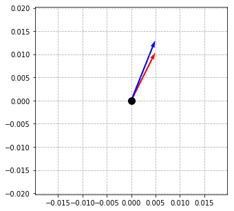

# The Jester Dataset


Today we will be building a recommendation system using User ratings of jokes.

By the end of this notebook, we will know how to 
- Format our data for user:user recommendation
- Find the cosign similarity between two vectors
- Use K Nearest Neighbor to indentify vector similarity
- Filter a dataframe to identify the highest rated joke based on K most similar users.


```python
import pandas as pd
import numpy as np

from sklearn.neighbors import NearestNeighbors
from sklearn.metrics.pairwise import cosine_similarity, cosine_distances


import matplotlib.pyplot as plt
import seaborn as sns

import warnings
warnings.filterwarnings("ignore")
```

### About user data
Format:

- Ratings are real values ranging from -10.00 to +10.00 (the value "99" corresponds to "null" = "not rated").
- One row per user
- The first column gives the number of jokes rated by that user. The next 100 columns give the ratings for jokes 01 - 100.
- The sub-matrix including only columns {5, 7, 8, 13, 15, 16, 17, 18, 19, 20} is dense. Almost all users have rated those jokes (see discussion of "universal queries" [here](http://eigentaste.berkeley.edu/)).


```python
df = pd.read_csv('./data/jesterfinal151cols.csv', header=None)
df = df.fillna(99)
```


```python
df.head()
```


<div>
<style scoped>
    .dataframe tbody tr th:only-of-type {
        vertical-align: middle;
    }

    .dataframe tbody tr th {
        vertical-align: top;
    }

    .dataframe thead th {
        text-align: right;
    }
</style>
<table border="1" class="dataframe">
  <thead>
    <tr style="text-align: right;">
      <th></th>
      <th>0</th>
      <th>1</th>
      <th>2</th>
      <th>3</th>
      <th>4</th>
      <th>5</th>
      <th>6</th>
      <th>7</th>
      <th>8</th>
      <th>9</th>
      <th>...</th>
      <th>141</th>
      <th>142</th>
      <th>143</th>
      <th>144</th>
      <th>145</th>
      <th>146</th>
      <th>147</th>
      <th>148</th>
      <th>149</th>
      <th>150</th>
    </tr>
  </thead>
  <tbody>
    <tr>
      <td>0</td>
      <td>62</td>
      <td>99</td>
      <td>99</td>
      <td>99</td>
      <td>99</td>
      <td>0.21875</td>
      <td>99</td>
      <td>-9.28125</td>
      <td>-9.28125</td>
      <td>99</td>
      <td>...</td>
      <td>99.0</td>
      <td>99.0</td>
      <td>99.0</td>
      <td>99.0</td>
      <td>99.0</td>
      <td>99.0</td>
      <td>99.0</td>
      <td>99.0</td>
      <td>99.0</td>
      <td>99.0</td>
    </tr>
    <tr>
      <td>1</td>
      <td>34</td>
      <td>99</td>
      <td>99</td>
      <td>99</td>
      <td>99</td>
      <td>-9.68750</td>
      <td>99</td>
      <td>9.93750</td>
      <td>9.53125</td>
      <td>99</td>
      <td>...</td>
      <td>99.0</td>
      <td>99.0</td>
      <td>99.0</td>
      <td>99.0</td>
      <td>99.0</td>
      <td>99.0</td>
      <td>99.0</td>
      <td>99.0</td>
      <td>99.0</td>
      <td>99.0</td>
    </tr>
    <tr>
      <td>2</td>
      <td>18</td>
      <td>99</td>
      <td>99</td>
      <td>99</td>
      <td>99</td>
      <td>-9.84375</td>
      <td>99</td>
      <td>-9.84375</td>
      <td>-7.21875</td>
      <td>99</td>
      <td>...</td>
      <td>99.0</td>
      <td>99.0</td>
      <td>99.0</td>
      <td>99.0</td>
      <td>99.0</td>
      <td>99.0</td>
      <td>99.0</td>
      <td>99.0</td>
      <td>99.0</td>
      <td>99.0</td>
    </tr>
    <tr>
      <td>3</td>
      <td>82</td>
      <td>99</td>
      <td>99</td>
      <td>99</td>
      <td>99</td>
      <td>6.90625</td>
      <td>99</td>
      <td>4.75000</td>
      <td>-5.90625</td>
      <td>99</td>
      <td>...</td>
      <td>99.0</td>
      <td>99.0</td>
      <td>99.0</td>
      <td>99.0</td>
      <td>99.0</td>
      <td>99.0</td>
      <td>99.0</td>
      <td>99.0</td>
      <td>99.0</td>
      <td>99.0</td>
    </tr>
    <tr>
      <td>4</td>
      <td>27</td>
      <td>99</td>
      <td>99</td>
      <td>99</td>
      <td>99</td>
      <td>-0.03125</td>
      <td>99</td>
      <td>-9.09375</td>
      <td>-0.40625</td>
      <td>99</td>
      <td>...</td>
      <td>99.0</td>
      <td>99.0</td>
      <td>99.0</td>
      <td>99.0</td>
      <td>99.0</td>
      <td>99.0</td>
      <td>99.0</td>
      <td>99.0</td>
      <td>99.0</td>
      <td>99.0</td>
    </tr>
  </tbody>
</table>
<p>5 rows × 151 columns</p>
</div>


### Joke data


```python
jokes = pd.read_table('./data/jester_items.tsv', header = None)
jokes.head()
```


<div>
<style scoped>
    .dataframe tbody tr th:only-of-type {
        vertical-align: middle;
    }

    .dataframe tbody tr th {
        vertical-align: top;
    }

    .dataframe thead th {
        text-align: right;
    }
</style>
<table border="1" class="dataframe">
  <thead>
    <tr style="text-align: right;">
      <th></th>
      <th>0</th>
      <th>1</th>
    </tr>
  </thead>
  <tbody>
    <tr>
      <td>0</td>
      <td>1:</td>
      <td>A man visits the doctor. The doctor says, "I h...</td>
    </tr>
    <tr>
      <td>1</td>
      <td>2:</td>
      <td>This couple had an excellent relationship goin...</td>
    </tr>
    <tr>
      <td>2</td>
      <td>3:</td>
      <td>Q. What's 200 feet long and has 4 teeth? A. Th...</td>
    </tr>
    <tr>
      <td>3</td>
      <td>4:</td>
      <td>Q. What's the difference between a man and a t...</td>
    </tr>
    <tr>
      <td>4</td>
      <td>5:</td>
      <td>Q. What's O. J. Simpson's web address? A. Slas...</td>
    </tr>
  </tbody>
</table>
</div>


The 0 column is the join column we need to connect with the user dataframe. 

I could clean the column, but it would be easier to just set our index to a range  of numbers.


```python
jokes.index = [x for x in range(1,150)]

jokes.drop(0, axis = 1, inplace = True)
```


```python
jokes.head()
```


<div>
<style scoped>
    .dataframe tbody tr th:only-of-type {
        vertical-align: middle;
    }

    .dataframe tbody tr th {
        vertical-align: top;
    }

    .dataframe thead th {
        text-align: right;
    }
</style>
<table border="1" class="dataframe">
  <thead>
    <tr style="text-align: right;">
      <th></th>
      <th>1</th>
    </tr>
  </thead>
  <tbody>
    <tr>
      <td>1</td>
      <td>A man visits the doctor. The doctor says, "I h...</td>
    </tr>
    <tr>
      <td>2</td>
      <td>This couple had an excellent relationship goin...</td>
    </tr>
    <tr>
      <td>3</td>
      <td>Q. What's 200 feet long and has 4 teeth? A. Th...</td>
    </tr>
    <tr>
      <td>4</td>
      <td>Q. What's the difference between a man and a t...</td>
    </tr>
    <tr>
      <td>5</td>
      <td>Q. What's O. J. Simpson's web address? A. Slas...</td>
    </tr>
  </tbody>
</table>
</div>


Nice.

### Cosine similarity

Cosine similarty = 1 - cosinedistance

#### What does cosine similarity measure?
- The angle between two vectors
    - if cosine(v1, v2) == 0 -> perpendicular
    - if cosine(v1, v2) == 1 -> same direction
    - if cosine(v1, v2) == -1 -> opposite direction

Let's create two vectors and find their cosine distance


```python
v1 = np.array([1, 2])
v2 = np.array([1, 2.5])

distance = cosine_distances(v1.reshape(1, -1), v2.reshape(1, -1))
distance
```


    array([[0.00345424]])


### Let's visualize our vectors in space using quiver plots


```python
V=np.array([v1, v2])
V
```


    array([[1. , 2. ],
           [1. , 2.5]])


```python
origin = [0], [0]
```


```python
plt.figure(figsize=(5, 5))
plt.grid(linestyle='dashed', zorder=0)
plt.scatter(*origin, s=100, c='k', zorder=2)
plt.quiver(*origin, V[:,0], V[:,1], color=['r','b'], scale=8, zorder=1)
plt.show()
```





```python
similarity = 1 - cosine_distances(v1.reshape(1, -1), v2.reshape(1, -1))
similarity
```


    array([[0.99654576]])


There is also an function for this that we can use.


```python
cosine_similarity(v1.reshape(1, -1), v2.reshape(1, -1))
```


    array([[0.99654576]])


### How do we build a recommender system?
- How do we recommend a joke to userA?
    - user to user ->
        - find users that are similar to userA
        - recommend highly rated jokes that userA has not rated by those users to userA

### Let's condition the data for a recommender system


```python
# build a flow for a given user then turn this into a function

## User we would like to recommend a joke to
user_index = np.random.randint(0, df.shape[0])
print(f"User {user_index} is our random user")

## Drop column that totals the numbers of jokes each user has rated. 
## Isolate the row for the desired user
userA = df.drop(0, axis=1).loc[user_index, :]

# let's get the other users
others = df.drop(0, axis=1).drop(index=user_index, axis=0)


# let's find the nearest neighbors
knn = NearestNeighbors(n_neighbors=5, metric='cosine', n_jobs=-1)
knn.fit(others)
```

    User 22815 is our random user


    NearestNeighbors(algorithm='auto', leaf_size=30, metric='cosine',
                     metric_params=None, n_jobs=-1, n_neighbors=5, p=2, radius=1.0)


Great! Now we can use the vectors of ratings for userA as an input to our knn model.

The knn model returns the distance between userA and the nears K neighbors as well as their index.


```python
distances, indices = knn.kneighbors(userA.values.reshape(1, -1))
distances, indices = distances[0], indices[0]


print('---------------------------------------------------------------------------------------------')
print("userA's K nearest neighbors:", distances) 
print('---------------------------------------------------------------------------------------------')
print("Index for nearest neighbors:",indices)
print('---------------------------------------------------------------------------------------------')
```

    ---------------------------------------------------------------------------------------------
    userA's K nearest neighbors: [0.00016893 0.00043711 0.00057741 0.00075709 0.00148437]
    ---------------------------------------------------------------------------------------------
    Index for nearest neighbors: [28048 21550 29166 21698  3596]
    ---------------------------------------------------------------------------------------------


#### Now that we have our most similar users, what's next?

#### Find their highest rated items that aren't rated by userA


```python
# let's get jokes not rated by userA
jokes_not_rated = np.where(userA==99)[0]
jokes_not_rated
```


    array([  0,   1,   2,   3,   4,   5,   8,   9,  10,  11,  13,  19,  20,
            21,  22,  23,  26,  28,  29,  30,  32,  34,  35,  36,  37,  38,
            40,  41,  42,  43,  44,  45,  46,  47,  48,  49,  50,  51,  52,
            53,  56,  57,  58,  59,  60,  61,  63,  65,  66,  67,  69,  70,
            72,  73,  74,  77,  78,  79,  80,  81,  83,  84,  85,  87,  88,
            89,  91,  92,  93,  94,  95,  96,  97,  98,  99, 100, 101, 102,
           103, 105, 106, 108, 109, 110, 112, 114, 115, 119, 121, 122, 123,
           124, 125, 126, 128, 129, 130, 132, 133, 135, 136, 137, 138, 139,
           140, 141, 148])


Next we need to isolate the nearest neighbors in our data, and examine their ratings for jokes userA has not rated.


```python
user_jokes = df.drop(0, axis=1).loc[indices, jokes_not_rated]
user_jokes
```


<div>
<style scoped>
    .dataframe tbody tr th:only-of-type {
        vertical-align: middle;
    }

    .dataframe tbody tr th {
        vertical-align: top;
    }

    .dataframe thead th {
        text-align: right;
    }
</style>
<table border="1" class="dataframe">
  <thead>
    <tr style="text-align: right;">
      <th></th>
      <th>0</th>
      <th>1</th>
      <th>2</th>
      <th>3</th>
      <th>4</th>
      <th>5</th>
      <th>8</th>
      <th>9</th>
      <th>10</th>
      <th>11</th>
      <th>...</th>
      <th>132</th>
      <th>133</th>
      <th>135</th>
      <th>136</th>
      <th>137</th>
      <th>138</th>
      <th>139</th>
      <th>140</th>
      <th>141</th>
      <th>148</th>
    </tr>
  </thead>
  <tbody>
    <tr>
      <td>28048</td>
      <td>NaN</td>
      <td>99</td>
      <td>99</td>
      <td>99</td>
      <td>99</td>
      <td>99.0</td>
      <td>1.40625</td>
      <td>99</td>
      <td>99</td>
      <td>99</td>
      <td>...</td>
      <td>99.00000</td>
      <td>99.0</td>
      <td>99.00000</td>
      <td>99.0</td>
      <td>99.0</td>
      <td>99.0</td>
      <td>99.0</td>
      <td>99.0</td>
      <td>99.0</td>
      <td>99.00000</td>
    </tr>
    <tr>
      <td>21550</td>
      <td>NaN</td>
      <td>99</td>
      <td>99</td>
      <td>99</td>
      <td>99</td>
      <td>99.0</td>
      <td>4.56250</td>
      <td>99</td>
      <td>99</td>
      <td>99</td>
      <td>...</td>
      <td>9.65625</td>
      <td>99.0</td>
      <td>9.09375</td>
      <td>99.0</td>
      <td>99.0</td>
      <td>99.0</td>
      <td>99.0</td>
      <td>99.0</td>
      <td>99.0</td>
      <td>9.56250</td>
    </tr>
    <tr>
      <td>29166</td>
      <td>NaN</td>
      <td>99</td>
      <td>99</td>
      <td>99</td>
      <td>99</td>
      <td>99.0</td>
      <td>-6.06250</td>
      <td>99</td>
      <td>99</td>
      <td>99</td>
      <td>...</td>
      <td>99.00000</td>
      <td>99.0</td>
      <td>99.00000</td>
      <td>99.0</td>
      <td>99.0</td>
      <td>99.0</td>
      <td>99.0</td>
      <td>99.0</td>
      <td>99.0</td>
      <td>99.00000</td>
    </tr>
    <tr>
      <td>21698</td>
      <td>NaN</td>
      <td>99</td>
      <td>99</td>
      <td>99</td>
      <td>99</td>
      <td>99.0</td>
      <td>-5.03125</td>
      <td>99</td>
      <td>99</td>
      <td>99</td>
      <td>...</td>
      <td>8.71875</td>
      <td>99.0</td>
      <td>4.28125</td>
      <td>99.0</td>
      <td>99.0</td>
      <td>99.0</td>
      <td>99.0</td>
      <td>99.0</td>
      <td>99.0</td>
      <td>-5.15625</td>
    </tr>
    <tr>
      <td>3596</td>
      <td>NaN</td>
      <td>99</td>
      <td>99</td>
      <td>99</td>
      <td>99</td>
      <td>99.0</td>
      <td>3.18750</td>
      <td>99</td>
      <td>99</td>
      <td>99</td>
      <td>...</td>
      <td>9.50000</td>
      <td>99.0</td>
      <td>-9.87500</td>
      <td>99.0</td>
      <td>99.0</td>
      <td>99.0</td>
      <td>99.0</td>
      <td>99.0</td>
      <td>99.0</td>
      <td>9.84375</td>
    </tr>
  </tbody>
</table>
<p>5 rows × 107 columns</p>
</div>


Let's total up the ratings of each joke!

To do this, we need to replace 99 values with 0


```python
ratings = user_jokes.replace(99, 0).sum()
```

Right now, the user_jokes dataframe has rows set to individual users and jokes set as columns.

We want to look at the jokes of each of these users. To do that, let's transform our user_jokes dataframe


```python
user_jokes = user_jokes.T

user_jokes.head()
```


<div>
<style scoped>
    .dataframe tbody tr th:only-of-type {
        vertical-align: middle;
    }

    .dataframe tbody tr th {
        vertical-align: top;
    }

    .dataframe thead th {
        text-align: right;
    }
</style>
<table border="1" class="dataframe">
  <thead>
    <tr style="text-align: right;">
      <th></th>
      <th>28048</th>
      <th>21550</th>
      <th>29166</th>
      <th>21698</th>
      <th>3596</th>
    </tr>
  </thead>
  <tbody>
    <tr>
      <td>0</td>
      <td>NaN</td>
      <td>NaN</td>
      <td>NaN</td>
      <td>NaN</td>
      <td>NaN</td>
    </tr>
    <tr>
      <td>1</td>
      <td>99.0</td>
      <td>99.0</td>
      <td>99.0</td>
      <td>99.0</td>
      <td>99.0</td>
    </tr>
    <tr>
      <td>2</td>
      <td>99.0</td>
      <td>99.0</td>
      <td>99.0</td>
      <td>99.0</td>
      <td>99.0</td>
    </tr>
    <tr>
      <td>3</td>
      <td>99.0</td>
      <td>99.0</td>
      <td>99.0</td>
      <td>99.0</td>
      <td>99.0</td>
    </tr>
    <tr>
      <td>4</td>
      <td>99.0</td>
      <td>99.0</td>
      <td>99.0</td>
      <td>99.0</td>
      <td>99.0</td>
    </tr>
  </tbody>
</table>
</div>


Great! Now we add the joke ratings as a column to our user_jokes dataframe


```python
user_jokes['total'] = ratings
```

Using the method .idxmax(), we return the index for the joke with the highest rating!


```python
recommend_index = user_jokes['total'].idxmax()
recommend_index
```


    69


```python
# checking our work
user_jokes.sort_values(by='total', ascending=False).head()
```


<div>
<style scoped>
    .dataframe tbody tr th:only-of-type {
        vertical-align: middle;
    }

    .dataframe tbody tr th {
        vertical-align: top;
    }

    .dataframe thead th {
        text-align: right;
    }
</style>
<table border="1" class="dataframe">
  <thead>
    <tr style="text-align: right;">
      <th></th>
      <th>28048</th>
      <th>21550</th>
      <th>29166</th>
      <th>21698</th>
      <th>3596</th>
      <th>total</th>
    </tr>
  </thead>
  <tbody>
    <tr>
      <td>69</td>
      <td>3.34375</td>
      <td>8.25000</td>
      <td>99.0000</td>
      <td>8.53125</td>
      <td>9.96875</td>
      <td>30.09375</td>
    </tr>
    <tr>
      <td>56</td>
      <td>3.25000</td>
      <td>9.81250</td>
      <td>99.0000</td>
      <td>6.90625</td>
      <td>9.84375</td>
      <td>29.81250</td>
    </tr>
    <tr>
      <td>132</td>
      <td>99.00000</td>
      <td>9.65625</td>
      <td>99.0000</td>
      <td>8.71875</td>
      <td>9.50000</td>
      <td>27.87500</td>
    </tr>
    <tr>
      <td>34</td>
      <td>99.00000</td>
      <td>8.93750</td>
      <td>99.0000</td>
      <td>7.71875</td>
      <td>9.93750</td>
      <td>26.59375</td>
    </tr>
    <tr>
      <td>114</td>
      <td>5.40625</td>
      <td>9.25000</td>
      <td>-3.0625</td>
      <td>4.62500</td>
      <td>9.87500</td>
      <td>26.09375</td>
    </tr>
  </tbody>
</table>
</div>


Now all we have to do is plug in the index to our jokes dataframe, and return the recommended joke!


```python
jokes.iloc[recommend_index][1]
```


    'Employer to applicant: "In this job we need someone who is responsible." Applicant: "I\'m the one you want. On my last job, every time anything went wrong, they said I was responsible."'


# We did it!

### Assignment

Please create a function called recommend_joke that will receive a user index, and spit out the recommended joke.

I recommend dividing up each step of the process coded out above ito seperate functions. This is standard practice in industry, makes our code easier to read, and makes testing for bugs an easier process. 

Please respond in your cohort slack channel with a recommended joke, and the index for the joke. 
Check to see if your recommendations match those of your cohort members.


```python
# build a flow for a given user then turn this into a function

```


```python
recommend_joke(400)
```


```python

```
